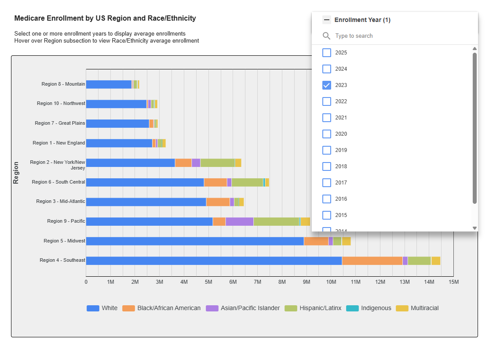
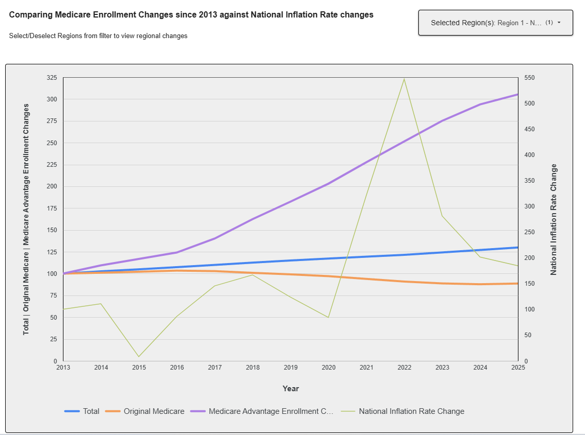
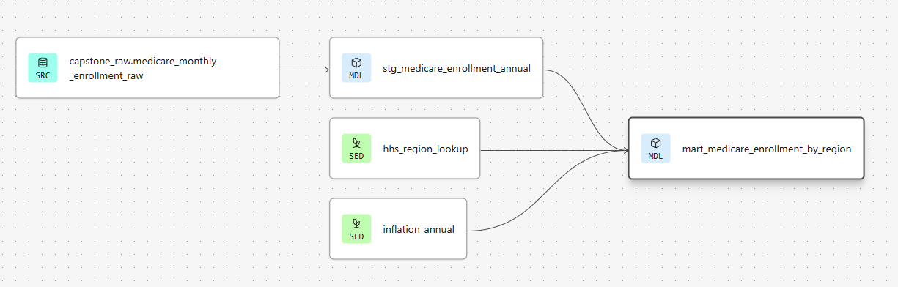

# DataTalksClub Data Engineering Zoomcamp Capstone Project

## Medicare Enrollment Trends & Inflation Analysis (2013–2025)

Author: June Lemieux

This project builds an end-to-end data pipeline that ingests, transforms, and visualizes 13 years of Medicare monthly enrollment data from CMS (Centers for Medicare & Medicaid Services), enriched with US inflation data from FRED (Federal Reserve Economic Data).

---

## Dashboard

**[View the Interactive Looker Studio Dashboard](https://lookerstudio.google.com/s/vGazz6a_XFg)**

The dashboard has two pages:

**Page 1 — Enrollment by US Region and Race/Ethnicity**
Shows Medicare enrollment broken out by race/ethnicity across the 10 HHS Regions for a selected year. Region 4 (Southeast) has the largest enrollment, while Region 9 (Pacific) shows a distinctly higher Hispanic/Latinx proportion relative to other regions.



**Page 2 — Enrollment Trends Over Time**
Compares the relative change in Total, Original Medicare, and Medicare Advantage (MA) enrollments since 2013, overlaid with the national inflation rate index. Select one or more HHS Regions to compare regional trends. Key insight: MA plan adoption has grown nearly 3x since 2013 across all regions, while Original Medicare enrollment has steadily declined — a structural shift independent of inflation.




---

## Data Sources

| Source | Description | Format | Update Frequency |
|--------|-------------|--------|-----------------|
| [CMS Medicare Monthly Enrollment](https://data.cms.gov/summary-statistics-on-beneficiary-enrollment/medicare-and-medicaid-reports/medicare-monthly-enrollment) | Medicare beneficiary enrollment by geography, demographics, and plan type | CSV | Monthly |
| [FRED US Inflation Data](https://fred.stlouisfed.org/series/FPCPITOTLZGUSA) | Annual US CPI inflation rate | CSV | Annual |
| [HHS Region Mapping](https://www.cdc.gov/cove/data-visualization-types/hhs-region-map.html) | CDC reference mapping US states and territories to the 10 HHS Administrative Regions | Reference | Static |

> **Note on inflation data:** In a production pipeline, the FRED inflation data would be ingested through the full Kestra pipeline (GCS → BigQuery raw → dbt silver → gold). For this project it is implemented as a dbt seed file — a pragmatic shortcut appropriate for a small, infrequently updated reference dataset.

> **Note on batch processing simulation:** The CMS source file (`Medicare Monthly Enrollment Data_December 2025.csv`) contains all 13 years of data (2013–2025) in a single file. To simulate batch processing, this file was split into 13 individual year-specific CSV files using a Python script and committed to the `/data` folder in this repository. The Kestra pipeline ingests these files one year at a time with a 30-second pause between each, simulating how a real pipeline would process incremental annual data loads.

---

## Architecture

```
GitHub (yearly CSV files)
        │
        ▼
   Kestra (orchestration)
        │
        ├─► GCS Bucket (Raw CSVs)
        │         │
        │         ▼
        │   BigQuery Raw Layer (capstone_raw)
        │         │
        └─► dbt Cloud Job
                  │
                  ├─► BigQuery Silver Layer (capstone_silver)
                  │     ├── stg_medicare_enrollment_annual
                  │     └── stg_medicare_enrollment_monthly
                  │
                  └─► BigQuery Gold Layer (capstone_gold)
                        └── mart_medicare_enrollment_by_region
                                  │
                                  ▼
                          Looker Studio Dashboard
```

**Tools & Technologies:**
- **Orchestration:** Kestra (Docker, self-hosted)
- **Cloud Platform:** Google Cloud Platform (GCP)
- **Data Lake:** Google Cloud Storage (GCS)
- **Data Warehouse:** BigQuery
- **Transformations:** dbt Cloud (free tier)
- **Visualization:** Looker Studio
- **Infrastructure:** Docker Compose

---

## Pipeline Details

### Batch Processing
Data is ingested year by year (2013–2025) with a 30-second pause between each year to simulate batch processing. Each year's CSV is stored as a separate file in GCS and appended to the BigQuery raw table sequentially.

### dbt Transformations



**Silver Layer (views):**
- `stg_medicare_enrollment_annual` — annual summary rows, all STRING columns cast to FLOAT64, asterisks replaced with 0
- `stg_medicare_enrollment_monthly` — monthly detail rows, same cleaning plus month name parsed to integer

**Gold Layer (table):**
- `mart_medicare_enrollment_by_region` — aggregates state-level data to HHS Region level, joins inflation data, computes enrollment index (2013=100) and inflation index (2013=100) for comparable visualization

**dbt Seeds:**
- `hhs_region_lookup` — maps US state abbreviations to HHS Region labels
- `inflation_annual` — annual US inflation rates (2013–2025) from FRED

---

## Repository Structure

```
datatalks-de-capstone/
├── flows/                          # Kestra flow YAML files
│   ├── de-capstone_00_setup_kvs.yaml
│   ├── de-capstone_01_verify_gcp_setup.yaml
│   ├── de-capstone_02_ingest_to_gcs.yaml
│   ├── de-capstone_03_load_to_bq_raw.yaml
│   └── de-capstone_04_dbt_bq_silver_gold.yaml
├── dbt/                            # dbt project
│   ├── models/
│   │   ├── staging/
│   │   │   ├── sources.yml
│   │   │   ├── stg_medicare_enrollment_annual.sql
│   │   │   └── stg_medicare_enrollment_monthly.sql
│   │   └── marts/
│   │       ├── marts.yml
│   │       └── mart_medicare_enrollment_by_region.sql
│   ├── seeds/
│   │   ├── hhs_region_lookup.csv
│   │   └── inflation_annual.csv
│   ├── macros/
│   │   └── generate_schema_name.sql
│   ├── tests/
│   │   ├── assert_annual_has_no_montly_rows.sql
│   │   └── assert_gold_region_totals_positive.sql
│   └── dbt_project.yml
├── data/                           # Yearly CMS CSV files (2013–2025)
│   ├── Medicare_Monthly_Enrollment_2013.csv
│   ├── Medicare_Monthly_Enrollment_2014.csv
│   └── ... (through 2025)
├── docker-compose.yml              # Kestra local setup
└── README.md
```

---

## Prerequisites

### GCP Setup
1. Create a GCP project — recommended name: `datatalks-de-capstone`
2. Enable the following APIs:
   - BigQuery API
   - Cloud Storage API
   - Compute Engine API
3. Create a GCP service account with these roles:
   - BigQuery Admin
   - Storage Admin
4. Download the service account JSON key file

### dbt Cloud Setup

> **Note for reviewers:** Flow `04` triggers a dbt Cloud job via API. You must set up your own dbt Cloud account and job, then update two flow files with your credentials before running flow `04`. The original author's dbt Cloud credentials in this repo are tied to a specific account and will not work for reproduction.

1. Create a free dbt Cloud account at [cloud.getdbt.com](https://cloud.getdbt.com)
2. Create a new project connected to this GitHub repo and your BigQuery project
3. Create a Service Account Token: **Account Settings → API Tokens → Service Account Tokens → New Token → Job Admin permission**
4. Create a dbt Cloud job named `de_capstone_silver_gold` with commands: `dbt seed`, `dbt run`, `dbt test`
5. Note your dbt Cloud **Account ID**, **Job ID**, and **host URL** from the job URL — the format is:
   ```
   https://<YOUR_HOST>/deploy/<account_id>/projects/<project_id>/jobs/<job_id>
   ```
6. Update `flows/de-capstone_00_setup_kvs.yaml` — replace the token value with your own:
   ```yaml
   - id: dbt_cloud_api_token
     type: io.kestra.plugin.core.kv.Set
     key: DBT_CLOUD_API_TOKEN
     kvType: STRING
     value: <your_dbt_cloud_service_account_token>
   ```
7. Update `flows/de-capstone_04_dbt_bq_silver_gold.yaml` — replace the account ID, job ID, and host in both URIs:
   ```yaml
   # Trigger URI:
   uri: "https://<YOUR_HOST>/api/v2/accounts/<your_account_id>/jobs/<your_job_id>/run/"

   # Status check URI:
   uri: "https://<YOUR_HOST>/api/v2/accounts/<your_account_id>/runs/?job_definition_id=<your_job_id>&order_by=-id&limit=1"
   ```
   > Note: The host (e.g. `th731.us1.dbt.com`) is specific to each dbt Cloud account. Use the host from your own dbt Cloud job URL.

### Local Requirements
- Docker Desktop
- VS Code with GitHub Codespaces (or local Docker)
- Git

---

## Setup & Reproduction Instructions

### Step 1: Clone the Repository
```bash
git clone https://github.com/lemieuxjm/datatalks-de-capstone.git
cd datatalks-de-capstone
```

### Step 2: Configure the GCP Service Account for Kestra
Encode your GCP service account JSON key for use with Kestra:
```bash
cat your-service-account-key.json | base64 > .env_encoded
```
Ensure `.env_encoded` is referenced in `docker-compose.yml` and is listed in `.gitignore`.

### Step 3: Start Kestra
```bash
docker compose up -d
```
Access Kestra at [http://localhost:8080](http://localhost:8080)

> **Note:** The `docker-compose.yml` uses `kestra/kestra:v0.22.0`. This version is required — using `latest` will result in a plugin version mismatch that prevents the GCP flows from loading. Kestra `v0.22.0` automatically downloads the compatible GCP plugin on first startup, which may add 1–2 minutes to initial boot time.

### Step 4: Import Flows into Kestra
Flows are automatically loaded from the `/flows` directory at startup via the `--flow-path /flows` command in `docker-compose.yml`. Verify all 5 flows are present in the Kestra UI under the `de-capstone` namespace before proceeding.

### Step 5: Configure KV Store
In Kestra UI, go to **Namespaces** → `de-capstone` → **KV Store** and add:

| Key | Value |
|-----|-------|
| `GCP_PROJECT_ID` | your GCP project ID |
| `GCP_LOCATION` | `us-central1` |
| `GCP_BUCKET_NAME` | your GCS bucket name |
| `GCP_DATASET_RAW` | `capstone_raw` |
| `GCP_DATASET_SILVER` | `capstone_silver` |
| `GCP_DATASET_GOLD` | `capstone_gold` |
| `YEARS` | `[2013,2014,2015,2016,2017,2018,2019,2020,2021,2022,2023,2024,2025]` |
| `DBT_CLOUD_API_TOKEN` | your dbt Cloud service account token |

> Alternatively, run flow `00_setup_kvs` to set all non-sensitive KV values automatically, then add `DBT_CLOUD_API_TOKEN` manually.

### Step 6: Provision GCP Infrastructure
Run flow `01_verify_gcp_setup` in Kestra. This creates:
- GCS bucket
- BigQuery datasets: `capstone_raw`, `capstone_silver`, `capstone_gold`

Verify in GCP Console that all resources were created.

### Step 7: Run the Pipeline
Run flows in order:

**Flow 02 — Ingest to GCS** (~7 minutes)
Downloads 13 yearly CSV files from GitHub and uploads to GCS with 30-second pauses between each year.

**Flow 03 — Load to BigQuery Raw** (~7 minutes)
Drops and recreates the raw table, then appends each year's data sequentially with 30-second pauses. Expected result: ~563,758 rows in `capstone_raw.medicare_monthly_enrollment_raw`.

**Flow 04 — dbt Transformations**
Triggers the dbt Cloud job which runs `dbt seed`, `dbt run`, and `dbt test`. Builds silver views and gold table in BigQuery.

> **Prerequisite for Flow 04:** You must complete the dbt Cloud setup steps in the Prerequisites section above and update the flow files with your own credentials before running this flow.

### Step 8: Verify Results
Run these queries in BigQuery to validate:

```sql
-- Confirm raw row count
SELECT COUNT(*) FROM `datatalks-de-capstone.capstone_raw.medicare_monthly_enrollment_raw`;
-- Expected: ~563,758

-- Confirm gold table has 10 regions per year
SELECT enrollment_year, COUNT(*) as region_count
FROM `datatalks-de-capstone.capstone_gold.mart_medicare_enrollment_by_region`
GROUP BY enrollment_year
ORDER BY enrollment_year;
-- Expected: 10 rows per year, 2013–2025

-- Confirm no nulls in key columns
SELECT COUNT(*) FROM `datatalks-de-capstone.capstone_gold.mart_medicare_enrollment_by_region`
WHERE total_benes IS NULL OR hhs_region IS NULL;
-- Expected: 0
```

> **Note:** The null check and region validation above are also enforced automatically by dbt tests as part of flow `04`. The `dbt test` step in the dbt Cloud job runs `not_null` tests on key columns and `accepted_values` tests on `hhs_region`. The row count check is provided here for manual reviewer convenience as it is not enforced by dbt tests.

### Step 9: View the Dashboard
Open the [Looker Studio Dashboard](https://lookerstudio.google.com/s/vGazz6a_XFg) — no login required, uses owner credentials.

---

## Shutting Down
```bash
docker compose down
```
To also remove volumes (clears all Kestra data):
```bash
docker compose down -v
```

---

## Known Limitations & Design Decisions

- **Inflation data as seed:** The FRED inflation CSV is loaded as a dbt seed rather than through the full ingestion pipeline. In a production system it would be ingested via Kestra → GCS → BigQuery raw → dbt silver.
- **Asterisk values in source data:** CMS suppresses small cell counts with `*` to protect beneficiary privacy. These are replaced with `0` during the silver transformation.
- **Float64 enrollment values:** CMS publishes enrollment counts with `.0` decimal formatting. Values are stored as FLOAT64 in BigQuery rather than INT64.
- **County data excluded:** The source data includes National, State, and County geographic levels. Only State-level records are used in the gold layer, aggregated to HHS Regions.
- **dbt Cloud free tier:** The free tier does not support personal API tokens. A Service Account Token is used instead for Kestra integration.
- **Kestra version pinned to v0.22.0:** The `docker-compose.yml` pins Kestra to `v0.22.0` to ensure plugin compatibility. Using `kestra/kestra:latest` causes a version mismatch between the Kestra core and the GCP plugin, preventing flows from loading.
